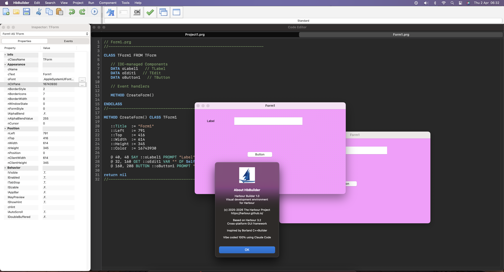

<div align="center">

# ⚓ HarbourBuilder

### The Most Powerful Cross-Platform Visual IDE for Harbour

[](LICENSE)
[](#platforms)
[](#component-palette)
[](docs/en/index.html)
[](https://claude.ai/claude-code)

**Design visually. Code in Harbour. Run natively on every platform.**

[Quick Start](#-quick-start) · [Features](#-features) · [Screenshots](#-screenshots) · [Documentation](docs/en/index.html) · [Tutorials](#-tutorials) · [Contributing](#-contributing)

</div>

---

## What is HarbourBuilder?

HarbourBuilder is a **Borland C++Builder-style visual IDE** that generates Harbour/xBase code. Drop controls from the palette, set properties in the inspector, double-click to write event handlers — and your app runs natively on Windows, macOS, and Linux with zero code changes.

**What you write:**
```harbour
#include "hbbuilder.ch"

function Main()
   local oForm, oBtn

   DEFINE FORM oForm TITLE "Hello World" SIZE 400, 300 FONT "Segoe UI", 10

   @ 120, 140 BUTTON oBtn PROMPT "Click Me!" OF oForm SIZE 120, 32
   oBtn:OnClick := { || MsgInfo( "Hello from HarbourBuilder!" ) }

   ACTIVATE FORM oForm CENTERED
return nil
```

**What the IDE generates** (two-way code sync from the visual designer):
```harbour
// Form1.prg

CLASS TForm1 FROM TForm

   // IDE-managed Components

   // Event handlers

   METHOD CreateForm()

ENDCLASS

METHOD CreateForm() CLASS TForm1
   ::Title  := "Form1"
   ::Left   := 100
   ::Top    := 170
   ::Width  := 400
   ::Height := 300
return nil
```

> Both styles run **identically** on Windows, macOS, and Linux — with native controls on each platform.

---

## ✨ Features

### 🎨 Visual Form Designer
- WYSIWYG form designer with dot grid and snap
- Drag & drop from component palette
- Selection handles with rubber band multi-select
- Real-time two-way tools: design ↔ code sync

### 📦 109 Components in 14 Tabs

| Tab | Controls | Description |
|-----|----------|-------------|
| **Standard** | 11 | Label, Edit, Memo, Button, CheckBox, RadioButton, ListBox, ComboBox, GroupBox, Panel, ScrollBar |
| **Additional** | 10 | BitBtn, SpeedButton, Image, Shape, Bevel, MaskEdit, StringGrid, ScrollBox, StaticText, LabeledEdit |
| **Native** | 9 | TabControl, TreeView, ListView, ProgressBar, RichEdit, TrackBar, UpDown, DateTimePicker, MonthCalendar |
| **System** | 2 | Timer, PaintBox |
| **Dialogs** | 6 | OpenDialog, SaveDialog, FontDialog, ColorDialog, FindDialog, ReplaceDialog |
| **Data Access** | 9 | DBF, MySQL, MariaDB, PostgreSQL, SQLite, Firebird, SQLServer, Oracle, MongoDB |
| **Data Controls** | 8 | TBrowse, DBGrid, DBNavigator, DBText, DBEdit, DBComboBox, DBCheckBox, DBImage |
| **Printing** | 8 | Printer, Report, Labels, PrintPreview, PageSetup, PrintDialog, ReportViewer, BarcodePrinter |
| **Internet** | 9 | WebView, WebServer, WebSocket, HttpClient, FtpClient, SmtpClient, TcpServer, TcpClient, UdpSocket |
| **ERP** | 12 | Preprocessor, ScriptEngine, ReportDesigner, Barcode, PDFGenerator, ExcelExport, AuditLog, Permissions, Currency, TaxEngine, Dashboard, Scheduler |
| **Threading** | 8 | Thread, Mutex, Semaphore, CriticalSection, ThreadPool, AtomicInt, CondVar, Channel |
| **AI** | 7 | OpenAI, Gemini, Claude, DeepSeek, Grok, Ollama, **Transformer** |

### 🔍 Object Inspector
- Properties tab with categorized grid (Appearance, Position, Behavior, Data)
- Events tab with **dynamic event list per control type** (UI_GETALLEVENTS)
- Double-click event → auto-generate handler code
- Color picker, font picker, inline editing
- ComboBox selector for all form controls

### 💻 Code Editor (Scintilla — all 3 platforms)
- **Scintilla 5.5+** editor on **all platforms** (same engine as Notepad++, SciTE, Code::Blocks)
  - Windows: Scintilla.dll + Lexilla.dll (dynamic)
  - macOS: libscintilla.a + liblexilla.a (static, compiled from source)
  - Linux: libscintilla.so + liblexilla.so (dynamic)
- VS Code Dark+ color theme with Harbour-aware syntax highlighting
- Keywords (blue, bold), commands (teal), comments (green, italic), strings (orange), numbers (light green), preprocessor (magenta)
- Built-in **line numbers**, **code folding**, and **indentation guides**
- Harbour-aware folding: function/return, class/endclass, if/endif, for/next, do/enddo, switch/endswitch, begin/end, #pragma begindump/enddump
- **Ctrl+F / Cmd+F** Find bar, **Ctrl+H / Cmd+H** Replace bar
- **Ctrl+Space / Cmd+Space** Auto-completion (150+ Harbour keywords, functions, xBase commands)
- **Ctrl+/ / Cmd+/** Toggle line comment
- **Ctrl+Shift+D / Cmd+Shift+D** Duplicate line
- **Ctrl+Shift+K / Cmd+Shift+K** Delete line
- **Ctrl+L / Cmd+L** Select line
- **Ctrl+G / Cmd+G** Go to line
- Auto-indent on Enter (preserves previous line indentation)
- Tabbed editor (Project1.prg + Form tabs)
- Status bar: Line, Column, INS/OVR, line count, char count, UTF-8

### 🤖 Built-in AI Assistant
- **Ollama integration** — local AI, no API keys, fully private
- Model selector: codellama, llama3, deepseek-coder, mistral, phi3, gemma2
- Chat interface with code suggestions
- Also supports **LM Studio** (OpenAI-compatible API)
- Future: inline code completion (Copilot-style)

### 🐛 Integrated Debugger (runs inside the IDE)
- **In-process debugging** — user code executes inside the IDE's Harbour VM via `.hrb` bytecode
- Harbour VM hook (`hb_dbg_SetEntry`) intercepts every source line
- Execution pauses at breakpoints or step commands while the IDE stays responsive
- **Professional debug toolbar**: ▶ Run, ⏸ Pause, ↓ Step Into, → Step Over, ■ Stop
- **5 dockable tabs** (bottom, Lazarus/C++Builder style):
  - **Watch** — evaluate expressions in the current scope
  - **Locals** — auto-populated with local variable Name, Value, Type (via `hb_dbg_vmVarLGet`)
  - **Call Stack** — full stack trace with Level, Function, Module, Line
  - **Breakpoints** — list with File, Line, Enabled status
  - **Output** — real-time debug log (pause points, session start/end)
- **Compile to .hrb**: `harbour -gh -b` produces portable bytecode with debug info
- **Load and execute**: `hb_hrbRun()` runs user code in the IDE's own VM
- **GTK event loop during pause**: `gtk_main_iteration()` keeps UI responsive while debugger waits
- Toggle/Clear breakpoints from Run menu
- Dark themed with monospace fonts and resizable columns

### 🌙 Dark Mode (all platforms)
- Windows: dark title bars via DwmSetWindowAttribute
- macOS: NSAppearanceNameDarkAqua applied app-wide on startup
- Linux: gtk-application-prefer-dark-theme toggle
- Dark code editor and documentation theme

### 📋 Project Management
- New Application / Open / Save / **Save As** projects (.hbp files)
- Multi-form support (Form1, Form2, Form3...)
- **Add to Project** (import .prg files) / **Remove from Project**
- **Install Component** / **New Component** (template generator)
- Project Inspector tree view
- Project Options dialog (Harbour / C Compiler / Linker / Directories)
- Editor Colors dialog with presets (Dark, Light, Monokai, Solarized)
- Full clipboard: **Cut / Copy / Paste / Undo / Redo** via Scintilla
- Build & Run with F9

---

## 📸 Screenshots

### Windows (Scintilla editor + Object Inspector + Form Designer)


### macOS (Cocoa/AppKit + Scintilla)


### Linux (GTK3 + Scintilla)


---

## 🏗️ Architecture

```
Application Code (.prg)
  → xBase Commands (hbbuilder.ch — compile-time, zero cost)
    → Harbour OOP (classes.prg — thin ACCESS/ASSIGN wrappers)
      → HB_FUNC Bridge (identical interface on all platforms)
        → Native Backend
           ├── Win32 API (C++ — CreateWindowEx, GDI, Scintilla)
           ├── Cocoa/AppKit (Objective-C — NSView, NSButton)
           └── GTK3 (C — GtkWidget, GtkFixed, Scintilla, Cairo)
```

### Debugger Architecture
```
Run > Debug:
  user.prg ──harbour -gh -b──→ user.hrb (bytecode + debug info)
                                   │
  IDE VM ─── hb_hrbRun() ─────────┘
    │
    ├─ hb_dbg_SetEntry(hook) ──→ VM calls hook on every line
    │                               │
    │                          ┌────┴────────────────────┐
    │                          │ Update Locals/Call Stack │
    │                          │ Highlight current line   │
    │                          │ while(paused)            │
    │                          │   gtk_main_iteration()   │
    │                          │ ← Step/Go/Stop button    │
    │                          └──────────────────────────┘
    │
    └─ User code continues...
```

### Performance

| Benchmark | FiveWin | HarbourBuilder | Speedup |
|-----------|---------|----------------|---------|
| Create 500 buttons | 0.243s | 0.001s | **243×** |
| Set property 100K× | 24.86s | 0.07s | **355×** |

---

## 🚀 Quick Start

### Windows
```bash
build_win.bat
```

### macOS
```bash
cd samples
./build_mac.sh
```

### Linux
```bash
cd samples
./build_gtk.sh
```

### Requirements
- [Harbour 3.2](https://harbour.github.io/) compiler
- Windows: [BCC 7.7](https://www.embarcadero.com/) (free) or MSVC
- macOS: Xcode Command Line Tools
- Linux: GCC + GTK3 dev (`apt install libgtk-3-dev`)

---

## 📚 Documentation

Professional HTML documentation with dark/light theme, Mermaid diagrams, and code examples:

| Page | Description |
|------|-------------|
| [Overview](docs/en/index.html) | Introduction + architecture diagram |
| [Quick Start](docs/en/quickstart.html) | 5-step getting started guide |
| [Architecture](docs/en/architecture.html) | 5-layer arch + 7 Mermaid diagrams |
| **Controls Reference** | |
| [Standard](docs/en/controls-standard.html) | Label, Edit, Button, CheckBox... (11) |
| [Additional](docs/en/controls-additional.html) | BitBtn, Image, Shape... (10) |
| [Native](docs/en/controls-native.html) | TreeView, ListView, DatePicker... (9) |
| [Data Access](docs/en/controls-database.html) | MySQL, PostgreSQL, SQLite... (9) |
| [Data Controls](docs/en/controls-datacontrols.html) | TBrowse, DBGrid, DBNavigator... (8) |
| [Internet](docs/en/controls-internet.html) | WebServer, WebSocket, TCP... (9) |
| [Threading](docs/en/controls-threading.html) | Thread, Mutex, Channel... (8) |
| [AI](docs/en/controls-ai.html) | OpenAI, Ollama, Transformer... (7) |
| [ERP](docs/en/controls-erp.html) | Report, Barcode, PDF... (12) |

---

## 📖 Tutorials

| Tutorial | What you'll build |
|----------|-------------------|
| [Hello World](docs/en/tutorial-hello.html) | Your first form with a button |
| [Working with Forms](docs/en/tutorial-forms.html) | Multi-form app with ShowModal |
| [Event Handling](docs/en/tutorial-events.html) | OnClick, OnChange, OnKeyDown |
| [Database CRUD](docs/en/tutorial-database.html) | SQLite + TBrowse data browser |
| [Web Server](docs/en/tutorial-webserver.html) | TODO app with TWebServer |
| [AI Integration](docs/en/tutorial-ai.html) | Ollama chat + Transformer |

### Transformer Examples

7 didactic examples in `samples/projects/transformer/`:
- **attention_visualizer.prg** — Attention weight heatmap
- **text_generator.prg** — Autoregressive generation with temperature
- **train_from_scratch.prg** — Training loop with loss curve
- **tokenizer_explorer.prg** — Interactive BPE tokenization
- **attention_is_all_you_need.prg** — Full paper walkthrough
- **sentiment_analyzer.prg** — BERT-style classification
- **translator_demo.prg** — Encoder-decoder translation

---

## 🖥️ Platforms

| Platform | Backend | Status |
|----------|---------|--------|
| **Windows** | Win32 API (C++) + Scintilla DLL | ✅ Full IDE |
| **macOS** | Cocoa/AppKit (Obj-C/C++) + Scintilla static lib | ✅ Full IDE |
| **Linux** | GTK3 (C) + Scintilla shared lib | ✅ Full IDE |
| **Android** | NDK + JNI | 🔮 Planned |
| **iOS** | UIKit (Objective-C) | 🔮 Planned |

---

## 📁 Project Structure

```
HarbourBuilder/
├── cpp/                          # Windows C++ core
│   ├── include/hbide.h           # 109 CT_ defines + class declarations
│   └── src/                      # tcontrol, tform, tcontrols, hbbridge
├── backends/
│   ├── cocoa/cocoa_core.m        # macOS Cocoa backend (Obj-C)
│   ├── cocoa/cocoa_editor.mm     # macOS Scintilla editor (Obj-C++)
│   ├── cocoa/cocoa_inspector.m   # macOS Object Inspector
│   ├── gtk3/gtk3_core.c          # Linux GTK3 backend + Scintilla
│   ├── console/backend.prg       # TUI console backend
│   └── web/backend.prg           # HTML5 Canvas backend
├── harbour/
│   ├── classes.prg               # TForm, TControl OOP wrappers
│   ├── hbbuilder.ch              # xBase #xcommand syntax
│   └── inspector.prg             # Object Inspector (Win32)
├── samples/
│   ├── hbbuilder_win.prg         # Windows IDE (full)
│   ├── hbbuilder_macos.prg       # macOS IDE
│   ├── hbbuilder_linux.prg       # Linux IDE
│   └── projects/transformer/     # 7 AI examples
├── docs/
│   ├── assets/css/docs.css       # DeepWiki-style theme
│   ├── assets/js/docs.js         # Search, theme, copy code
│   └── en/                       # 20 HTML pages
├── resources/
│   ├── Scintilla.dll             # Scintilla 5.6.1 (Windows, 32-bit)
│   ├── Lexilla.dll               # Lexilla 5.4.8 (Windows, 32-bit)
│   ├── libscintilla.so           # Scintilla (Linux, x86_64)
│   ├── liblexilla.so             # Lexilla (Linux, x86_64)
│   ├── scintilla_src/            # Scintilla + Lexilla source (macOS build)
│   │   ├── build/libscintilla.a  # Scintilla (macOS, static)
│   │   └── build/liblexilla.a    # Lexilla (macOS, static)
│   ├── lazarus_icons/            # Professional PNG icons
│   └── harbour_logo.png          # About dialog logo
├── build_win.bat                 # Windows build script
├── build_scintilla.sh            # Linux Scintilla build script
└── ChangeLog.txt                 # Detailed changelog
```

---

## 🤝 Contributing

HarbourBuilder is open source and welcomes contributions:

1. Fork the repository
2. Create a feature branch (`git checkout -b feature/amazing-control`)
3. Implement for **all 3 platforms** (Win32 + Cocoa + GTK3)
4. Add documentation in `docs/en/`
5. Submit a Pull Request

### Adding a New Control

1. Add `CT_MYCONTROL` to `hbide.h` (and both backends)
2. Create class in `tcontrols.cpp` (constructor + `CreateParams`)
3. Add `HB_FUNC(UI_MyControlNew)` in `hbbridge.cpp`
4. Add widget creation in `cocoa_core.m` and `gtk3_core.c`
5. Add to palette in all 3 IDE `.prg` files
6. Add events in `UI_GETALLEVENTS`
7. Document in `docs/en/`

---

## ⚡ Built with Claude Code

This entire framework — from the C++ core and native backends to the Harbour OOP layer, visual designer, AI assistant, and 20-page documentation — was **vibe coded 100% using [Claude Code](https://claude.ai/claude-code)**.

A new paradigm in software development.

---

## 📄 License

MIT License — free for personal and commercial use.

---

<div align="center">

**⭐ Star this repo if you believe in the future of Harbour development!**

Made with ❤️ by [Antonio Linares](https://github.com/AntoninoLinares) and [Claude Code](https://claude.ai/claude-code)

</div>
